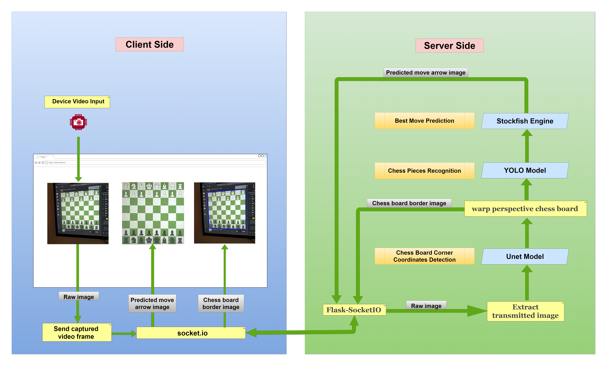

# Yolo-Segmentation-Chess

This is a self-learning project that demonstrates how to detect chess board corner points, locate chess pieces on the chess board, and predict chess moves in real time.

## Project Flow

### Setup

- Use a python virtualenv  `python3 -m venv Venv`
- `https://github.com/Vatsalparsaniya/Yolo-Segmentation-Chess.git`
- `pip install -r requirements.txt`

### Run locally

- start app using `python3 main.py` and open app on your phone with your maching ip and `5000` port-number ex. `https://192.168.4.67:5000/`
- make sure you use `https` instead of `http`. 
- Since I'm using locally produced SSL certificates, the risk warning will appear, but you can overlook it.
- grant camera permissions.
- Generate your own certificate if SSL certified doesn't work, [here](https://stackoverflow.com/a/32169444/9735841) or  [here](https://blog.miguelgrinberg.com/post/running-your-flask-application-over-https)

♔♕♗♘♙♚♛♝♞♟♖♜

The camera captures the image of chessboard then the image is analyzed using image processing to identify the moves made by an opponent and stockfish engine calculates the best possible move.

### Method of Working

### Example

Input-Frame |	Predicted Mask |	Corner Points |	Warp Perspective Image |	Yolo Inference Image
-|-|-|-|-
 |  |  |  | 
 |  |  |  | 

